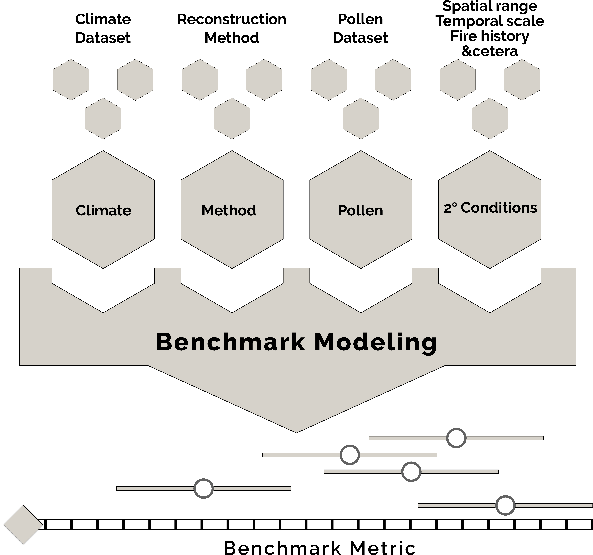
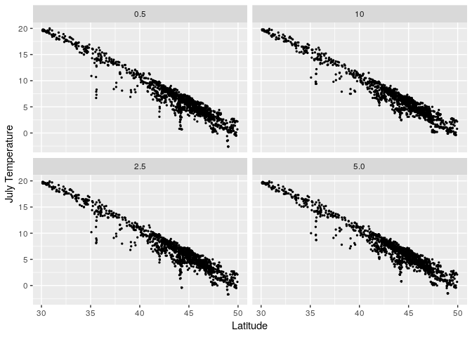

## Submission

### Open Quaternary

*Methods papers that outline and test new techniques and discuss potential applications and significance of the technique. In addition, papers that critique or modify extant methodologies and approaches are welcome. Authors should provide a detailed summary of the protocol followed and establish replicability within the body of the paper.*

Submissions should be between 6,000 and 8,000 words in length for Research, Methods, and Review papers, although submissions of all lengths will be considered.

## Abstract

An outline of methods used and a standardization of benchmarking techniques.

## Introduction

Researchers have used multiple pollen-based reconstruction models to reconstruct past climates [@birks2014quantitative], many of which are described in Chevalier &al. [@chevalierinpress]. Similarities among climatic reconstructions appear when we examine records from multiple proxy records (e.g., [@veski2015quantitative;@rosen2003diatom]), or reconstructions using a single proxy with different reconstruction methods. Because of differences in spatial domain, method application and underlying datasets among papers it is often difficult to compare results between studies.  For example, if chironomid and pollen records from the same core show differences in their down-core reconstruction [e.g., @rosen2003diatom], it may be due to bioligical aspects of the organism-climate relations, but it may also be due to differences in the spatial distribution of modern samples with respect to climate or secondary factors, or perhaps the size and extent of the different training set [@juggins2013quantitative]. If two reconstructions are performed using different methods on the same proxy and on the same core, and there are differences in the reconstruction, it is not clear which may be "correct", unless all of the biases and other issues of the various methods are understood [e.g., @peyron2011holocene;@brewer2008climate].  Similarly, comparing pollen-based climate reconstructions across a region, or between regions is similarly difficult if the methods or data differed among the studies.

There remain many questions about the various methodologies used in paleoclimate reconstruction, especially as newer ones are developed [e.g., @salonen2014reconstructing; @tingley2010bayesian]. Given the complexity of the questions around training-sets, data source and methodological assumptions, a framework for the systematic comparison of different methods using a standardized set of datasets is needed to properly evaluate and understand paleoclimate reconstructions at a larger spatial scales, and across proxies. This kind of formal comparison is common in the climate modeling community [CMIP: @taylor2012overview; PMIP: @braconnot2012evaluation], but has not become standard in evaluating choices in proxy-based paleoclimate reconstructions.

We are doing this experiment using pollen data as these are the most widely used paleoclimate proxy records for Holocene-scale reconstructions. Importantly, continental databases are available from North America, Europe, and being developed for other parts of the world [@williams2017neotoma], and new paleogeoinformatics approaches have provided the computational support to enable these methods to be generated as part of a reproducible workflow [@brewer2012paleoecoinformatics;@goring2015neotoma]. There is now sufficient data available to test questions about the importance of the traiing-set domain, site density, or the impact of the environment gradient length on paleoclimate reconstructions. Within a well structured framework we anticipate that studies can be attempted on local, regional but also at continental and intercontinental scales. We anticipate that the results of these studies will be applicable to any proxy record.

## Pollen-Based Reconstruction Practice

This paper surveyed 31 papers dealing with paleoclimate reconstruction from pollen data spanning the period from 2002 to 2018.  Reconstructions include 9 papers from Europe, and 10 from North America, as well as reconstructions from China, Russia, Africa and New Zealand (Table 1).

<!--html_preserve-->

<!--/html_preserve-->

## A Need for Benchmarks

Benchmarking climate reconstruction models is necessary because benchmarks provides a common platform under which methods can be tested to a set of pre-defined standards.  This then allows us to test hypotheses about different methods, examine the causes of method divergence and convergence and ask questions about how underlying physical and ecological processes might affect model reliability, precision and accuracy in a paleoecological context.

{ width=50% }

## Methods

The set of resources for the Pollen-Climate Model Intercomparison Project (PC-MIP) includes fully documented pollen data, obtained from the Neotoma Paleoecology Database (both surface and core samples), the African Pollen Database, and from the Whitmore et al [-@whitmore2005modern] North American Modern Pollen Dataset.  These resources have all been standardized and prepared for use in intercomparison workflows.  Climate data has been similarly standardized from WorldClim [using the `raster` package: @hijmans2018raster;@hijmans2005very] and from downscaled simulations using CCSM3 [@lorenz2016downscaled].

These standardized data resources are then to be used within the context of standardized reconstruction methods, implemented using R, with a set of defined and standardized model outputs

### Datasets

#### Pollen Data

North American Modern Pollen Dataset version 1.8 [NAMPD; @whitmore2005modern]:  The NAMPD v1.8 contains 4833 modern pollen samples obtained from the published and unpublished sources, along with matched climate and vegetation data. It is a research dataset, and therefore does not contain all of the pollen counts; for example rare and aquatic taxa are excluded. It is in the form of a series of tables in an excel file.

#### Climate Data

One question of interest is the importance of climate dataset in affecting climate reconstructions [@fortin2012potential;@ladd2015impact]. Although a number of methods have been used to assign climate data to pollen samples, for over 20 years, the most common method is to use widely-available gridded datsets(CRU,New et al; WorldClim; BEst;). These are available in different resolutions whcih may affect the results obtained. In addition, the various products have been shown to have biases in data-sparse regions, for example the Arctic [@way2015testing], and these can affect the results obtained, at least in a regional scale [@fortin2012potential]. We therefore obtained xx datasets to compare the extent to which different datasets are affected by the climate data. For example, MAT produces reconstructions with higher high frequency variability, in part dependent on the resolution of the climate data.

### Methods

Pollen-based climate reconstruction has a number of implementations, some of which are implemented directly in R, others which have been implemented in other programming languages or as executable scripts.  This benchmarking approach uses wrappers for these methods, providing the opportunity to link to individual methods in a consistent manner, while still retaining the flexibility inherent to individual models or their various implementations.

| Method | Implementation | Citation |
| ------ | -------------- | -------- |
| MAT | `rioja` | [@rioja2017]    |
| WA | `rioja`  | [@rioja2017]    |

All wrapped functions are implemented using R to provide a consistent output format.

### Tests

Testing models in cross-validation is a common method in statistics and machine learning to evaluate the predictive performance of a model. Cross-validation consists of five steps: 1) setting aside a subset of the data (called a test set), 2) fitting a model using the rest of the data (called a training set), 3) generating predictions for the held out test set, 4) evaluating the predictions versus the known truth for the test set, and 5) repeating the process with a different test and training set.

In the context of paleoclimatic reconstruction careful consideration is required when generalizing from cross-validation performance to potential reconstruction performance (Jackson 2012). (need to expand on this; may belong in a different place)

Here we perform 10-fold cross-validation. This means that in each fold the test set comprises 10% of the full training dataset and after the ten folds every observation in the modern calibration dataset will have been in the test set.

We first evaluate cross-validation experiments by plotting the observed versus predicted covariate for each sample. We fit a linear regression to this and compare the slope to the one-to-one line. For a perfect model, the predicted values would fall directly on the one-to-one line. If the linear regression slope is less than one this indicates a shrinkage to the mean in the predictions. Slopes greater than one are not common in the context of the models we will be using, but they would indicate too large a variance in the predictions.

In addition to plotting, we evaluate the predictions using four scoring metrics: mean square error (MSE), mean absolute error (MAE), empirical coverage of the 95% credible interval, and continuous rank probability score (CRPS). These are standard in statistics and each emphasize different predictive skill. MSE measures prediction accuracy of the mean while MAE emphasizes prediction accuracy of the median. For both MSE and MAE lower values represent better predictions. MSE and MAE do not contain much information on the models' skill in variance, for that we use coverage. Coverage is how many of the e.g. 95% credible intervals of the predicted covariate overlap with the observed covariate -- if the empirical coverage for a model's predictions is close to the nominal rate (in this case, 95%) then we can say the model has a good variance and meaningful uncertainties. CRPS is a combined metric for the accuracy of both the mean and the spread of the uncertainty and is especially useful for models that generate a full predictive distribution (Gneiting 2011). Lower CRPS values represent better predictions.

## Working Example

### Climate datasets

The benchmarking method proposed above provides an opportunity to examine the impacts of base data choice and resolution, by providing a framework with which to test multiple pollen based climate models, multiple base climate data and multiple resolutions of the climate data.

<!-- -->

Within the benchmarking system a set of curated datasets are provided.  These datasets are fully described and returned as data objects from the `pcmip-data` package.  This package provides certain standardized elements, for example, data extraction based on the parent calibration dataset.

To analyze the effects of input data on the calibration methods we began by asking a simple, but illustrative question.

## Results

### Climate Resolution

Climate data was obtained from WorldClim at four different native resolutions, from the 10, 5, 2.5 and 0.5 arcminute data products [REF].  These data were then overlain on the location data for Whitmore et al. [-@whitmore2005modern] described earlier.

## Conclusion

## References
